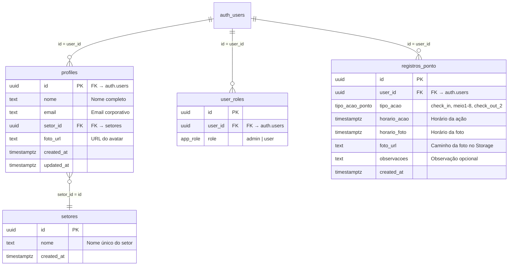

<div class="cover">
  
  
  # Manual Tecnico
  
  ## Sistema Controle de Ronda
  
  ---
  
  **Versao 1.0.0**
  
  02 de Setembro de 2026
  
  Documento Interno — CONFIDENCIAL
  
  Equipe de Desenvolvimento BA Eletrica
  
  suporte04@baeletrica.com.br
</div>

<br/>

## Sumário

- [1. Informações do Documento](#1-informações-do-documento)
  - [1.1 Histórico de Versões](#11-histórico-de-versões)
  - [1.2 Público-Alvo](#12-público-alvo)
  - [1.3 Como Usar Este Manual](#13-como-usar-este-manual)
- [2. Visão Geral do Projeto](#2-visão-geral-do-projeto)
  - [2.1 O que é o Sistema](#21-o-que-é-o-sistema)
  - [2.2 Quem Usa o Sistema](#22-quem-usa-o-sistema)
  - [2.3 Stack Tecnológica](#23-stack-tecnológica)
  - [2.4 Arquitetura de Alto Nível](#24-arquitetura-de-alto-nível)
  - [2.5 Conceitos e Terminologia](#25-conceitos-e-terminologia)
- [3. Estrutura do Projeto](#3-estrutura-do-projeto)
  - [3.1 Mapa de Diretórios](#31-mapa-de-diretórios)
  - [3.2 Arquivos Raiz](#32-arquivos-raiz)
  - [3.3 Código-Fonte (src/)](#33-código-fonte-src)
  - [3.4 Supabase](#34-supabase)
  - [3.5 Google Apps Script](#35-google-apps-script)
  - [3.6 GitHub Actions](#36-github-actions)
  - [3.7 Onde Mexer para Cada Tipo de Alteração](#37-onde-mexer-para-cada-tipo-de-alteração)
- [4. Banco de Dados](#4-banco-de-dados)
  - [4.1 Diagrama Entidade-Relacionamento](#41-diagrama-entidade-relacionamento)
  - [4.2 Tabelas](#42-tabelas)
  - [4.3 Enums e Tipos](#43-enums-e-tipos)
  - [4.4 Funções de Banco](#44-funções-de-banco)
  - [4.5 Triggers](#45-triggers)
  - [4.6 Storage Buckets](#46-storage-buckets)
  - [4.7 Row-Level Security (RLS)](#47-row-level-security-rls)
  - [4.8 Histórico de Migrations](#48-histórico-de-migrations)
- [5. API e Edge Functions](#5-api-e-edge-functions)
  - [5.1 Autenticação](#51-autenticação)
  - [5.2 send-daily-report](#52-send-daily-report)
  - [5.3 send-monthly-report](#53-send-monthly-report)
  - [5.4 health](#54-health)
  - [5.5 CORS e Headers](#55-cors-e-headers)
- [6. Frontend — Rotas e Telas](#6-frontend--rotas-e-telas)
  - [6.1 Mapa de Rotas](#61-mapa-de-rotas)
  - [6.2 Layout Raiz](#62-layout-raiz)
  - [6.3 Rotas do Funcionário](#63-rotas-do-funcionário)
  - [6.4 Rotas do Administrador](#64-rotas-do-administrador)
- [7. Lógica de Negócio](#7-lógica-de-negócio)
  - [7.1 Ciclo de Ronda](#71-ciclo-de-ronda)
  - [7.2 Detecção de Ciclo](#72-detecção-de-ciclo)
  - [7.3 Filtro por Setor](#73-filtro-por-setor)
  - [7.4 Sistema de Roles](#74-sistema-de-roles)
  - [7.5 Timezone](#75-timezone)
- [8. Componentes](#8-componentes)
  - [8.1 Componentes Customizados](#81-componentes-customizados)
  - [8.2 Componentes shadcn/ui](#82-componentes-shadcnui)
- [9. Lib e Utilitários](#9-lib-e-utilitários)
- [10. Segurança](#10-segurança)
  - [10.1 Inventário de Chaves](#101-inventário-de-chaves)
  - [10.2 Variáveis de Ambiente](#102-variáveis-de-ambiente)
  - [10.3 Problemas de Segurança Identificados](#103-problemas-de-segurança-identificados)
  - [10.4 Recomendações de Remediação](#104-recomendações-de-remediação)
- [11. Deploy e CI/CD](#11-deploy-e-cicd)
  - [11.1 Cloudflare Workers (Frontend)](#111-cloudflare-workers-frontend)
  - [11.2 Supabase Edge Functions](#112-supabase-edge-functions)
  - [11.3 Google Apps Script](#113-google-apps-script)
  - [11.4 GitHub Actions](#114-github-actions)
  - [11.5 Sequência de Deploy](#115-sequência-de-deploy)
  - [11.6 Rollback](#116-rollback)
- [12. Cron e Agendamento](#12-cron-e-agendamento)
  - [12.1 pg_cron — Jobs Ativos](#121-pg_cron--jobs-ativos)
  - [12.2 Cronograma Diário](#122-cronograma-diário)
  - [12.3 Cron Mensal](#123-cron-mensal)
  - [12.4 Diagnóstico de Falhas](#124-diagnóstico-de-falhas)
- [13. Troubleshooting](#13-troubleshooting)
  - [13.1 Tabela de Problemas Comuns](#131-tabela-de-problemas-comuns)
  - [13.2 Comandos de Diagnóstico](#132-comandos-de-diagnóstico)
- [14. Runbooks](#14-runbooks)
  - [14.1 Deploy de Edge Function](#141-deploy-de-edge-function)
  - [14.2 Migração de Banco](#142-migração-de-banco)
  - [14.3 Rotação de Segredos](#143-rotação-de-segredos)
  - [14.4 Envio Manual de Relatório](#144-envio-manual-de-relatório)
- [15. Apêndices](#15-apêndices)
  - [15.1 Glossário](#151-glossário)
  - [15.2 Contatos e Responsáveis](#152-contatos-e-responsáveis)
  - [15.3 Referências](#153-referências)

---

# 1. Informações do Documento

## 1.1 Histórico de Versões

| Versão | Data | Autor | Alterações |
|--------|------|-------|------------|
| 1.0.0 | 02/09/2026 | Equipe Desenvolvimento | Versão inicial — documento completo |

## 1.2 Público-Alvo

Este manual é destinado a:

- **Desenvolvedores** que precisam manter, corrigir ou evoluir o sistema
- **Administradores de sistema** que precisam fazer deploy, monitorar ou resolver incidentes
- **Gestores de TI** que precisam entender a arquitetura e capacidades do sistema
- **Novos integrantes** da equipe que precisam de contexto completo

## 1.3 Como Usar Este Manual

- **Capítulo 2-3**: Comece aqui para entender o projeto como um todo
- **Capítulo 4-5**: Para entender banco de dados e API
- **Capítulo 6-9**: Para mexer no frontend e lógica de negócio
- **Capítulo 10**: Para questões de segurança
- **Capítulo 11-12**: Para deploy e agendamento
- **Capítulo 13-14**: Para resolver problemas e executar rotinas
- **Capítulo 15**: Consultas rápidas

---

# 2. Visão Geral do Projeto

## 2.1 O que é o Sistema

O **Controle de Ronda** é um sistema web/mobile desenvolvido pela BA Elétrica para gerenciar e auditar rondas de vigilância em suas unidades (CD — Centro de Distribuição e LOJA). O sistema permite:

1. **Registro de rondas**: Funcionários batem ponto fotográfico em 10 etapas (check-in, 8 fotos intermediárias, check-out)
2. **Gestão administrativa**: Administradores visualizam registros, gerenciam usuários e setores
3. **Relatórios automáticos**: Sistema envia PDFs profissionais com fotos por email diariamente e mensalmente
4. **Auditoria completa**: Cada registro inclui foto com sobreposição de nome, data/hora e GPS

## 2.2 Quem Usa o Sistema

| Perfil | Acesso | Funcionalidades |
|--------|--------|-----------------|
| **Admin** | `/admin/*` | Dashboard, gestão de usuários, setores, registros, relatórios, observações |
| **Funcionário** | `/app/*` | Bater ponto (câmera), ver perfil, histórico de rondas |
| **Gestor** | Email | Recebe relatórios PDF diários e mensais por email |

**Conta admin protegida**: Apenas `suporte04@baeletrica.com.br` possui role admin. Todos os outros usuários são role `user`.

## 2.3 Stack Tecnológica

### Frontend (Produção)

| Camada | Tecnologia | Versão | Função |
|--------|-----------|--------|--------|
| Framework | TanStack Start | ^1.167.50 | SSR + File-based routing |
| UI Library | React | ^19.2.0 | Componentes de interface |
| Bundler | Vite | ^7.3.1 | Build e dev server |
| Deploy | Cloudflare Workers | - | Edge computing global |
| Estilo | Tailwind CSS | ^4.2.1 | Utility-first CSS |
| UI Kit | shadcn/ui (New York) | - | 46 componentes prontos |
| Icons | Lucide React | ^0.575.0 | Ícones SVG |
| Forms | React Hook Form + Zod | ^7.71.2 / ^3.24.2 | Validação de formulários |
| Charts | Recharts | ^2.15.4 | Gráficos |
| PDF | pdf-lib | ^1.17.1 | Geração de PDF no client |
| XLSX | xlsx | ^0.18.5 | Planilhas Excel |
| Date | date-fns + date-fns-tz | ^4.1.0 / ^3.2.0 | Manipulação de datas com timezone |
| Auth | Supabase Auth | ^2.106.2 | Autenticação |

### Backend (Produção)

| Camada | Tecnologia | Função |
|--------|-----------|--------|
| Database | Supabase (PostgreSQL) | Banco de dados relacional |
| Auth | Supabase Auth | Autenticação e sessões |
| Storage | Supabase Storage | Fotos e avatares |
| Edge Functions | Supabase Edge Functions (Deno) | Lógica server-side |
| Cron | pg_cron | Agendamento de tarefas |
| Email (primário) | Resend API | Envio de emails transacionais |
| Email (fallback) | Google Apps Script (GmailApp) | Fallback de envio |

### Infraestrutura

| Componente | Tecnologia | URL |
|-----------|-----------|-----|
| Frontend | Cloudflare Workers | `https://controle-ronda.suporte04.workers.dev` |
| Backend | Supabase | `https://rdmbayprbfqbjhfqcasp.supabase.co` |
| CI/CD | GitHub Actions | Push to main → auto-deploy |
| DNS | Cloudflare | `baeletrica.com.br` |

## 2.4 Arquitetura de Alto Nível

### Camada de Acesso

| Componente | Tecnologia | Descrição |
|------------|-----------|-----------|
| **Frontend** | TanStack Start + React | Interface do usuário (SSR + CSR) |
| **Deploy** | Cloudflare Workers | `controle-ronda.suporte04.workers.dev` |
| **Edge Functions** | Supabase Deno | `send-daily-report`, `send-monthly-report`, `health` |
| **Email Primário** | Resend API | Envio de relatórios com anexos PDF/XLSX |
| **Email Fallback** | Google Apps Script | `GmailApp` via `suporte.baeletrica@gmail.com` |

### Camada de Dados (Supabase)

| Serviço | Função | Segurança |
|---------|--------|-----------|
| **PostgreSQL** | Banco de dados principal | RLS (Row-Level Security) ativo |
| **Storage** | Fotos de rondas e avatares | Bucket `fotos_ponto` (privado), `avatars` (público) |
| **pg_cron** | Agendamento de relatórios | CD 07:00, LOJA 07:05, Mensal dia 1 08:00 |
| **Auth** | Autenticação de usuários | JWT + Roles (funcionario, admin, gestor) |

### Fluxo Geral

```
USUARIO -> FRONTEND -> EDGE FUNCTIONS -> SUPABASE
                           |
              +------------+------------+
              |                         |
         RESEND API               GOOGLE APPS
         (primario)               SCRIPT (fallback)
              |                         |
              +------------+------------+
                           |
                     EMAIL DESTINATARIO
```

### Fluxo de Dados — Relatório Diário

| Etapa | Operação | Detalhes |
|-------|----------|----------|
| 1 | **pg_cron dispara** | 07:00 (CD) ou 07:05 (LOJA) horário de Manaus |
| 2 | **net.http_post** | Chama Edge Function `send-daily-report` |
| 3 | **Query registros_ponto** | Seleciona registros das últimas 24h |
| 4 | **Join profiles + setores** | Enriquece dados com nome e setor |
| 5 | **Filtrar por setor** | CD (`73a5d2ca`) ou LOJA (`ad1b42c1`) |
| 6 | **Buscar destinatários** | Admins com role GESTOR no setor correspondente |
| 7 | **Download fotos** | Limitado a 40 fotos ( URLs assinadas) |
| 8 | **Gerar PDF** | `pdf-lib` — capa, tabela, badges, fotos |
| 9 | **Gerar XLSX** | `xlsx` — planilha para análise |
| 10 | **[PRIMÁRIO] Resend API** | Envia email com anexos |
| 11 | **[SE FALHAR] GAS** | Google Apps Script → GmailApp |
| 12 | **Retorno JSON** | Status do envio |

## 2.5 Conceitos e Terminologia

| Termo | Definição |
|-------|-----------|
| **Ronda** | sequência completa de 10 registros fotográficos (check-in → 8 meios → check-out) |
| **Ciclo** | Uma ronda completa. O sistema suporta múltiplos ciclos por dia |
| **Setor** | Unidade de trabalho: CD (Centro de Distribuição) ou LOJA |
| **Passo** | Cada etapa individual da ronda (check_in, meio1-8, check_out_2) |
| **Bater Ponto** | Ação de registrar um passo da ronda com foto |
| **Gestor** | Usuário administrador que recebe relatórios por email |
| **Edge Function** | Função server-side rodando no Supabase (Deno runtime) |
| **pg_cron** | Agendamento de tarefas via PostgreSQL (extensão cron) |
| **Resend** | Serviço de envio de emails transacionais (API REST) |
| **GAS** | Google Apps Script — fallback para envio de emails via GmailApp |

---

# 3. Estrutura do Projeto

## 3.1 Mapa de Diretórios

```
controle-ronda/
├── .github/
│   └── workflows/
│       ├── deploy.yml                    # Deploy automático para Cloudflare Workers
│       └── supabase-reports.yml          # Keep-alive do Supabase
├── docs/
│   └── MANUAL_TECNICO.md                 # Este documento
├── google-apps-script/
│   ├── Code.gs                           # Script GAS (email fallback)
│   └── appsscript.json                   # Manifesto GAS
├── public/
│   └── logo.png                          # Logo BA Elétrica
├── src/
│   ├── components/
│   │   ├── AdminSidebar.tsx              # Sidebar admin
│   │   ├── CameraCapture.tsx             # Captura de câmera
│   │   ├── EmployeeBottomNav.tsx         # Nav inferior funcionário
│   │   ├── ThemeToggle.tsx               # Toggle dark/light
│   │   └── ui/                           # 46 componentes shadcn/ui
│   ├── hooks/
│   │   └── use-mobile.tsx                # Detecção mobile
│   ├── integrations/
│   │   └── supabase/
│   │       ├── auth-attacher.ts          # Auth attacher
│   │       ├── auth-middleware.ts         # Auth middleware
│   │       ├── client.ts                 # Cliente Supabase (client-side)
│   │       ├── client.server.ts          # Cliente Supabase (server-side, service_role)
│   │       └── types.ts                  # Tipos gerados do banco
│   ├── lib/
│   │   ├── api/
│   │   │   └── example.functions.ts      # Exemplo de server function
│   │   ├── access.functions.ts           # Sincronização de acesso
│   │   ├── admin-users.functions.ts      # CRUD de usuários admin
│   │   ├── auth.tsx                      # Contexto de autenticação
│   │   ├── config.ts                     # Config (SUPPORT_EMAIL)
│   │   ├── config.server.ts              # Config server-side
│   │   ├── date-filters.ts               # Filtros de data
│   │   ├── error-capture.ts              # Captura de erros
│   │   ├── error-page.ts                 # Página de erro HTML
│   │   ├── lovable-error-reporting.ts    # Reporting de erros
│   │   ├── photoOverlay.ts               # Sobreposição em Canvas
│   │   ├── report.functions.ts           # Chamada ao Edge Function
│   │   ├── storage.ts                    # URLs assinadas
│   │   ├── theme.tsx                     # Contexto de tema
│   │   ├── timezone.ts                   # Utilitários Manaus timezone
│   │   └── utils.ts                      # cn() utility
│   ├── routes/
│   │   ├── __root.tsx                    # Layout raiz
│   │   ├── index.tsx                     # Landing page
│   │   ├── login.tsx                     # Login
│   │   ├── app.tsx                       # Layout funcionário
│   │   ├── app.index.tsx                 # Dashboard funcionário
│   │   ├── app.perfil.tsx                # Perfil
│   │   ├── app.historico.tsx             # Histórico
│   │   ├── admin.tsx                     # Layout admin
│   │   ├── admin.index.tsx               # Dashboard admin
│   │   ├── admin.usuarios.tsx            # Gestão de usuários
│   │   ├── admin.setores.tsx             # Gestão de setores
│   │   ├── admin.registros.tsx           # Registros de ronda
│   │   ├── admin.observacoes.tsx         # Observações
│   │   ├── admin.relatorio-ronda.tsx     # Relatório de ronda
│   │   ├── admin.ronda-detalhe.$id.$inicio.tsx  # Detalhe da ronda
│   │   └── routeTree.gen.ts              # Route tree auto-gerado
│   ├── server.ts                         # Server entry
│   ├── start.ts                          # App start
│   └── router.tsx                        # Router config
├── supabase/
│   ├── config.toml                       # Config Supabase
│   ├── functions/
│   │   ├── health/index.ts               # Health check
│   │   ├── send-daily-report/index.ts    # Relatório diário (1208 linhas)
│   │   └── send-monthly-report/index.ts  # Relatório mensal (929 linhas)
│   └── migrations/                       # 13 migrations SQL
├── .env.example                          # Template de variáveis
├── .gitignore
├── components.json                       # Config shadcn/ui
├── docker-compose.yml                    # Docker (legado)
├── eslint.config.js
├── nginx.conf                            # Nginx (legado)
├── package.json
├── package-lock.json
├── tsconfig.json
├── vite.config.ts
└── wrangler.toml                         # Config Cloudflare Workers
```

## 3.2 Arquivos Raiz

| Arquivo | Função | Deployado? |
|---------|--------|-----------|
| `wrangler.toml` | Config Cloudflare Workers | Sim ( Workers) |
| `package.json` | Dependências e scripts NPM | Sim (build) |
| `tsconfig.json` | Config TypeScript | Sim (build) |
| `vite.config.ts` | Config Vite | Sim (build) |
| `eslint.config.js` | Linter | Não (dev only) |
| `.prettierrc` | Formatter | Não (dev only) |
| `components.json` | Config shadcn/ui | Sim (build) |
| `docker-compose.yml` | Stack legado | Não (legado) |
| `nginx.conf` | Nginx legado | Não (legado) |
| `.env.example` | Template env vars | Não (referência) |
| `.gitignore` | Ignorados pelo git | N/A |

## 3.3 Código-Fonte (src/)

### Rotas

| Arquivo | Rota | Descrição |
|---------|------|-----------|
| `__root.tsx` | `/` | Layout raiz (AuthProvider, ThemeProvider, Toaster) |
| `index.tsx` | `/` | Landing page / redirect |
| `login.tsx` | `/login` | Tela de login (Supabase Auth) |
| `app.tsx` | `/app` | Layout funcionário (bottom nav) |
| `app.index.tsx` | `/app` | Dashboard — "Bater Ponto" |
| `app.perfil.tsx` | `/app/perfil` | Perfil do funcionário |
| `app.historico.tsx` | `/app/historico` | Histórico de rondas |
| `admin.tsx` | `/admin` | Layout admin (sidebar) |
| `admin.index.tsx` | `/admin` | Dashboard admin |
| `admin.usuarios.tsx` | `/admin/usuarios` | Gestão de usuários (993 linhas) |
| `admin.setores.tsx` | `/admin/setores` | Gestão de setores |
| `admin.registros.tsx` | `/admin/registros` | Registros de ronda (851 linhas) |
| `admin.observacoes.tsx` | `/admin/observacoes` | Observações (256 linhas) |
| `admin.relatorio-ronda.tsx` | `/admin/relatorio-ronda` | Relatório de ronda (499 linhas) |
| `admin.ronda-detalhe.$id.$inicio.tsx` | `/admin/ronda-detalhe/:id/:inicio` | Detalhe da ronda |

### Lib

| Arquivo | Função Principal | Exportações |
|---------|-----------------|-------------|
| `auth.tsx` | Autenticação | `AuthProvider`, `useAuth()` |
| `config.ts` | Configuração | `SUPPORT_EMAIL` |
| `config.server.ts` | Config server | Variáveis de ambiente server-side |
| `timezone.ts` | Timezone Manaus | `toManausISO()`, `formatManaus()`, `CICLO_RONDA`, `proximaAcao()`, `TipoAcao` |
| `storage.ts` | Storage | `getSignedPhotoUrl()` |
| `photoOverlay.ts` | Canvas | `overlayPhoto()` |
| `date-filters.ts` | Filtros data | Predefined date ranges |
| `report.functions.ts` | Reports | `sendReport()` |
| `admin-users.functions.ts` | CRUD Users | `createUser()`, `updateUser()`, `deleteUser()` |
| `access.functions.ts` | Access | `syncUserAccess()` |
| `utils.ts` | Utils | `cn()` |
| `theme.tsx` | Tema | `ThemeProvider` |

## 3.4 Supabase

| Caminho | Função |
|---------|--------|
| `config.toml` | Configuração do projeto Supabase |
| `functions/health/index.ts` | Health check (keep-alive) |
| `functions/send-daily-report/index.ts` | Relatório diário (1208 linhas) |
| `functions/send-monthly-report/index.ts` | Relatório mensal (929 linhas) |
| `migrations/` | 13 migrations SQL (histórico completo) |

## 3.5 Google Apps Script

| Arquivo | Função |
|---------|--------|
| `Code.gs` | Script principal — envio de emails via GmailApp com PDF |
| `appsscript.json` | Manifesto — scopes, runtime V8, timezone America/Manaus |

**Deploy GAS**: Editor GAS → Executar manualmente → Criar implantação → Web App
**Conta GAS**: `suporte.baeletrica@gmail.com` (pessoal Gmail, NÃO Workspace)
**URL de implantação**: `https://script.google.com/macros/s/AKfycbw-.../exec`

## 3.6 GitHub Actions

| Workflow | Trigger | Função |
|----------|---------|--------|
| `deploy.yml` | Push to main | Build + Deploy para Cloudflare Workers |
| `supabase-reports.yml` | Cron diário 06:00 UTC | Keep-alive do endpoint health |

## 3.7 Onde Mexer para Cada Tipo de Alteração

| Tipo de Alteração | Arquivo(s) a Modificar |
|-------------------|----------------------|
| **Adicionar nova rota** | `src/routes/nova-rota.tsx` |
| **Mudar aparencia** | `src/components/ui/*` ou `tailwind` classes |
| **Mudar lógica de ronda** | `src/lib/timezone.ts` |
| **Mudar ciclo (adicionar passo)** | `src/lib/timezone.ts` → `CICLO_RONDA` |
| **Mudar filtros de data** | `src/lib/date-filters.ts` |
| **Mudar envio de email** | `supabase/functions/send-daily-report/index.ts` |
| **Mudar PDF do relatório** | `supabase/functions/send-daily-report/index.ts` → `buildPdf()` |
| **Mudar layout email** | `supabase/functions/send-daily-report/index.ts` → `buildEmailHtml()` |
| **Mudar destinatários** | `supabase/functions/send-daily-report/index.ts` → `fetchRecipientEmails()` |
| **Mudar cron** | `supabase/migrations/` (SQL do pg_cron) |
| **Mudar autenticação** | `src/lib/auth.tsx`, `src/integrations/supabase/client*.ts` |
| **Mudar RLS policies** | `supabase/migrations/` (SQL das policies) |
| **Mudar schema do banco** | `supabase/migrations/` (novo arquivo SQL) |
| **Mudar deploy frontend** | `wrangler.toml`, `.github/workflows/deploy.yml` |
| **Mudar fallback email GAS** | `google-apps-script/Code.gs` |
| **Mudar segredos Resend** | Supabase Dashboard → Edge Functions → Secrets |
| **Mudar segredos Cloudflare** | `wrangler secret put CLOUDFLARE_API_TOKEN` |
| **Adicionar componente UI** | `npx shadcn@latest add componente` |
| **Mudar config shadcn** | `components.json` |
| **Mudar dependências** | `package.json` |

---

# 4. Banco de Dados

## 4.1 Diagrama Entidade-Relacionamento



## 4.2 Tabelas

### 4.2.1 `profiles`

Tabela de perfis dos usuários. Criada automaticamente quando um usuário se cadastra.

| Coluna | Tipo | Constraints | Descrição |
|--------|------|------------|-----------|
| `id` | UUID | PK, FK → auth.users, ON DELETE CASCADE | ID do usuário |
| `nome` | TEXT | NOT NULL | Nome completo |
| `email` | TEXT | NOT NULL | Email corporativo |
| `setor_id` | UUID | FK → setores, ON DELETE SET NULL | Setor do usuário |
| `foto_url` | TEXT | nullable | Caminho do avatar no Storage |
| `created_at` | TIMESTAMPTZ | DEFAULT now() | Data de criação |
| `updated_at` | TIMESTAMPTZ | DEFAULT now() | Última atualização |

### 4.2.2 `user_roles`

Roles dos usuários. Um usuário pode ter múltiplas roles.

| Coluna | Tipo | Constraints | Descrição |
|--------|------|------------|-----------|
| `id` | UUID | PK, DEFAULT gen_random_uuid() | ID do registro |
| `user_id` | UUID | FK → auth.users, ON DELETE CASCADE | ID do usuário |
| `role` | app_role | NOT NULL | 'admin' ou 'user' |

**Constraint**: UNIQUE(user_id, role) — um usuário não pode ter a mesma role duas vezes.

### 4.2.3 `registros_ponto`

Registros de pontos das rondas. Cada linha = uma foto/etapa da ronda.

| Coluna | Tipo | Constraints | Descrição |
|--------|------|------------|-----------|
| `id` | UUID | PK, DEFAULT gen_random_uuid() | ID do registro |
| `user_id` | UUID | FK → auth.users, ON DELETE CASCADE | ID do vigilante |
| `tipo_acao` | tipo_acao_ponto | NOT NULL | Etapa da ronda |
| `horario_acao` | TIMESTAMPTZ | NOT NULL | Horário que a ação foi registrada |
| `horario_foto` | TIMESTAMPTZ | DEFAULT now() | Horário que a foto foi tirada |
| `foto_url` | TEXT | NOT NULL | Caminho da foto no Storage |
| `observacoes` | TEXT | nullable | Observação opcional |
| `created_at` | TIMESTAMPTZ | DEFAULT now() | Data de criação |

### 4.2.4 `setores`

Setores de trabalho (CD, LOJA, GESTOR, etc.).

| Coluna | Tipo | Constraints | Descrição |
|--------|------|------------|-----------|
| `id` | UUID | PK, DEFAULT gen_random_uuid() | ID do setor |
| `nome` | TEXT | UNIQUE, NOT NULL | Nome do setor |
| `created_at` | TIMESTAMPTZ | DEFAULT now() | Data de criação |

**Setores existentes:**

| ID | Nome |
|----|------|
| `e49fba28-...` | DEPARTAMENTO TI |
| `ed4cc5bb-...` | GESTOR |
| `73a5d2ca-...` | CD - GUARDAS |
| `ad1b42c1-...` | LOJA - GUARDAS |
| `bef20765-...` | GESTOR - LOJA |
| `bc749fe5-...` | GESTOR - CD |

## 4.3 Enums e Tipos

### `app_role`

```sql
CREATE TYPE app_role AS ENUM ('admin', 'user');
```

### `tipo_acao_ponto`

```sql
CREATE TYPE tipo_acao_ponto AS ENUM (
  'check_in',   -- Início da ronda
  'meio1',      -- Foto intermediária 1
  'meio2',      -- Foto intermediária 2
  'meio3',      -- Foto intermediária 3
  'meio4',      -- Foto intermediária 4
  'meio5',      -- Foto intermediária 5
  'meio6',      -- Foto intermediária 6
  'meio7',      -- Foto intermediária 7
  'meio8',      -- Foto intermediária 8
  'check_out_1',-- Check-out intermediário (legado)
  'check_out_2' -- Fim da ronda
);
```

## 4.4 Funções de Banco

### `has_role(role app_role) RETURNS boolean`

Verifica se o usuário atual tem uma role específica. Usa `SECURITY DEFINER` para evitar recursão de RLS.

```sql
CREATE OR REPLACE FUNCTION public.has_role(role app_role)
RETURNS boolean
LANGUAGE sql
SECURITY DEFINER
STABLE
AS $$
  SELECT EXISTS (
    SELECT 1 FROM public.user_roles
    WHERE user_id = auth.uid() AND role = $1
  );
$$;
```

**Uso em RLS policies**: `SELECT public.has_role('admin')`

### `handle_new_user() RETURNS trigger`

Trigger executado quando um novo usuário é criado no `auth.users`. Cria o profile e asigna role `user`.

```sql
CREATE OR REPLACE FUNCTION public.handle_new_user()
RETURNS trigger
LANGUAGE plpgsql
SECURITY DEFINER
AS $$
BEGIN
  INSERT INTO public.profiles (id, nome, email)
  VALUES (NEW.id, COALESCE(NEW.raw_user_meta_data->>'nome', 'Usuário'), NEW.email);
  INSERT INTO public.user_roles (user_id, role)
  VALUES (NEW.id, 'user');
  RETURN NEW;
END;
$$;
```

### `update_updated_at() RETURNS trigger`

Trigger que atualiza automaticamente a coluna `updated_at` na tabela `profiles`.

```sql
CREATE OR REPLACE FUNCTION public.update_updated_at()
RETURNS trigger
LANGUAGE plpgsql
AS $$
BEGIN
  NEW.updated_at = now();
  RETURN NEW;
END;
$$;
```

## 4.5 Triggers

| Trigger | Tabela | Evento | Função |
|---------|--------|--------|--------|
| `on_auth_user_created` | `auth.users` | AFTER INSERT | `handle_new_user()` |
| `update_profiles_updated_at` | `profiles` | BEFORE UPDATE | `update_updated_at()` |

## 4.6 Storage Buckets

| Bucket | Acesso | Uso |
|--------|--------|-----|
| `fotos_ponto` | Privado (authenticated read, own folder) | Fotos das rondas |
| `avatars` | Público | Fotos de perfil |
| `assinaturas` | Privado (legado) | Assinaturas |
| `comprovantes_entrega` | Privado (legado) | Comprovantes |

### Estrutura de Caminhos

```
fotos_ponto/
├── {user_id}/
│   ├── {timestamp}_check_in.jpg
│   ├── {timestamp}_meio1.jpg
│   └── ...

avatars/
├── {user_id}/
│   └── avatar.jpg
```

## 4.7 Row-Level Security (RLS)

RLS está habilitado em **todas** as tabelas. Políticas principais:

### `profiles`

| Política | Operação | Condição |
|----------|----------|----------|
| `profiles_select_own` | SELECT | `auth.uid() = id` |
| `profiles_select_admin` | SELECT | `has_role('admin')` |
| `profiles_insert_own` | INSERT | `auth.uid() = id` |
| `profiles_update_own` | UPDATE | `auth.uid() = id` |
| `profiles_update_admin` | UPDATE | `has_role('admin')` |

### `registros_ponto`

| Política | Operação | Condição |
|----------|----------|----------|
| `registros_insert_own` | INSERT | `auth.uid() = user_id` |
| `registros_select_own` | SELECT | `auth.uid() = user_id` |
| `registros_select_admin` | SELECT | `has_role('admin')` |

### `user_roles`

| Política | Operação | Condição |
|----------|----------|----------|
| `user_roles_select_own` | SELECT | `auth.uid() = user_id` |
| `user_roles_select_admin` | SELECT | `has_role('admin')` |
| `user_roles_insert_admin` | INSERT | `has_role('admin')` |

### `setores`

| Política | Operação | Condição |
|----------|----------|----------|
| `setores_select_auth` | SELECT | `auth.role() = 'authenticated'` |
| `setores_insert_admin` | INSERT | `has_role('admin')` |

## 4.8 Histórico de Migrations

| # | Arquivo | Data | Propósito |
|---|---------|------|-----------|
| 1 | `20260601145649_...` | 01/06/2026 | Schema inicial: profiles, user_roles, registros_ponto, setores, RLS, policies, trigger |
| 2 | `20260601145710_...` | 01/06/2026 | Restringir acesso a storage (revoke PUBLIC, fotos read only authenticated) |
| 3 | `20260605003344_...` | 05/06/2026 | Restringir SELECT storage para own folder; bloquear INSERT em user_roles para não-admins |
| 4 | `20260609130218_...` | 09/06/2026 | Comentário: relatórios diários via pg_cron |
| 5 | `20260610120000_...` | 10/06/2026 | Fix abrangente de segurança: recriar enums, tabelas, RLS, policies, storage, revoke EXECUTE |
| 6 | `20260612000000_...` | 12/06/2026 | Cleanup: manter apenas usuário suporte04 (admin) |
| 7 | `20260612010000_...` | 12/06/2026 | Adicionar foto_url ao profiles + bucket avatars |
| 8 | `20260715000000_...` | 15/07/2026 | Estender ciclo: meio1-meio8 + coluna observacoes |
| 9 | `20260715120000_...` | 15/07/2026 | Comentário: relatórios mensais via pg_cron |
| 10 | `20260728000000_...` | 28/07/2026 | Criar pg_cron jobs: diário (11:00 UTC) + mensal (12:00 UTC dia 1) |
| 11 | `20260729000000_...` | 29/07/2026 | Corrigir pg_cron: jobs separados CD (11:00) e LOJA (11:02) |
| 12 | `20260818000000_...` | 18/08/2026 | Fix todos os Supabase Advisors warnings |
| 13 | `20260818120000_...` | 18/08/2026 | Fix restante: has_role EXECUTE, dropar policies amplas de storage |

---

# 5. API e Edge Functions

## 5.1 Autenticação

As Edge Functions do Supabase usam dois mecanismos:

1. **Service Role Key**: Acessa o banco diretamente sem RLS (via `SUPABASE_SERVICE_ROLE_KEY`)
2. **Cron Auth**: O pg_cron envia requests com o JWT anon key no header `Authorization`

Para chamadas manuais, use o header:
```
Authorization: Bearer {SUPABASE_SERVICE_ROLE_KEY}
```

## 5.2 send-daily-report

**URL**: `POST https://rdmbayprbfqbjhfqcasp.supabase.co/functions/v1/send-daily-report`

### Parâmetros (Body JSON)

| Parâmetro | Tipo | Obrigatório | Descrição |
|-----------|------|-------------|-----------|
| `modo` | string | Não | Ignorado (hardcoded "diario") |
| `setor` | string | Não | "CD" ou "LOJA". Se omitido, envia ambos |
| `periodo` | string | Não | Formato "YYYY-MM-DD/YYYY-MM-DD" ou "hoje_ontem". Se omitido, usa últimas 24h |
| `override_email` | string | Não | Email para teste (ignorado em produção) |

### Headers

```
Content-Type: application/json
Authorization: Bearer {SUPABASE_ANON_KEY ou SERVICE_ROLE_KEY}
```

### Resposta (JSON)

```json
{
  "ok": true,
  "modo": "diario",
  "setor": "CD",
  "periodo": "25/08/2026 07:00 a 26/08/2026 06:59 (America/Manaus)",
  "count": 60,
  "recipients": ["email1@baeletrica.com.br", "..."],
  "id": "uuid-do-email"
}
```

### Fluxo de Execução (detalhado)

```
1. Parse body -> setorParam, periodoParam
2. rangeFor(modo, periodoParam) -> fromUtc, toUtc
3. fetchRows(admin, fromUtc, toUtc)
   - SELECT registros_ponto WHERE horario_acao BETWEEN fromUtc AND toUtc
   - SELECT profiles (todos)
   - SELECT setores (todos)
   - JOIN: r.user_id -> profiles -> setores -> r.setor = setores.nome
4. fetchRecipientEmails(admin, setorParam)
   - SELECT user_roles WHERE role = 'admin' -> adminIds
   - SELECT setores -> filtrar: nome IN ('GESTOR', 'GESTOR - CD', 'GESTOR - LOJA')
   - CD: aceita setores com "GESTOR" E SEM "LOJA"
   - LOJA: aceita setores com "GESTOR" E SEM "CD"
   - Para cada admin: verificar se setor_id pertence a gestorIds
5. Para cada SETOR (CD e/ou LOJA):
   - Filtrar rows por setor (r.setor.toUpperCase().includes(match))
   - Se 0 rows -> skip
   - Download fotos (limit 40) + avatares
   - reconstructRondas() -> agrupar por user_id e ciclo
   - buildPdf() -> gerar PDF com pdf-lib
   - Anexar ao array de attachments
6. Se attachments = 0 -> retornar "Nenhum registro"
7. buildEmailHtml() -> HTML do email
8. sendResend() -> enviar email com anexos PDF
   - Se falhar -> sendGasFallback() -> GAS URL
9. Retornar JSON com status
```

### Cron Schedule

```
CD:  0 11 * * * (11:00 UTC = 07:00 Manaus)
LOJA: 5 11 * * * (11:05 UTC = 07:05 Manaus)
```

## 5.3 send-monthly-report

**URL**: `POST https://rdmbayprbfqbjhfqcasp.supabase.co/functions/v1/send-monthly-report`

### Parâmetros

| Parâmetro | Tipo | Obrigatório | Descrição |
|-----------|------|-------------|-----------|
| `setor` | string | Não | "CD" ou "LOJA" |
| `periodo` | string | Não | Formato "YYYY-MM/YYYY-MM" |

### Diferenças do Relatório Diário

- Janela de tempo: mês inteiro ao invés de 24h
- Inclui dashboard estatístico com gráficos
- PDF mais detalhado com indicadores de conformidade
- Enviado no dia 1 de cada mês às 08:00 Manaus

## 5.4 health

**URL**: `GET https://rdmbayprbfqbjhfqcasp.supabase.co/functions/v1/health`

**Resposta**:
```json
{ "status": "ok", "timestamp": "2026-09-02T..." }
```

Usado pelo GitHub Actions para manter o Supabase ativo (keep-alive).

## 5.5 CORS e Headers

```typescript
const corsHeaders = {
  "Access-Control-Allow-Origin": "https://controle-ronda.suporte04.workers.dev",
  "Access-Control-Allow-Headers": "authorization, x-client-info, apikey, content-type",
};
```

---

# 6. Frontend — Rotas e Telas

## 6.1 Mapa de Rotas

```
/                           → Redirect (baseado no role)
/login                      → Tela de login
/app                        → Layout funcionário (bottom nav)
  /app/                     → Dashboard "Bater Ponto"
  /app/perfil               → Perfil do funcionário
  /app/historico            → Histórico de rondas
/admin                      → Layout admin (sidebar)
  /admin/                   → Dashboard admin
  /admin/usuarios           → Gestão de usuários
  /admin/setores            → Gestão de setores
  /admin/registros          → Registros de ronda
  /admin/observacoes        → Observações
  /admin/relatorio-ronda    → Relatório de ronda
  /admin/ronda-detalhe/:id/:inicio → Detalhe da ronda
```

## 6.2 Layout Raiz (`__root.tsx`)

- `AuthProvider` (Supabase Auth context)
- `ThemeProvider` (dark/light mode)
- `Toaster` (notificações sonner)
- `Outlet` (renderiza a rota filha)

## 6.3 Rotas do Funcionário (`/app/*`)

### Dashboard — Bater Ponto (`app.index.tsx`)

- Exibe passo atual da ronda (check_in, meio1-8, check_out_2)
- Botão para tirar foto
- `CameraCapture` abre câmera do dispositivo
- Foto receive overlay com nome + timestamp
- Upload para Supabase Storage (`fotos_ponto`)
- Insert em `registros_ponto`
- Progresso visual do ciclo (10 etapas)

### Perfil (`app.perfil.tsx`)

- Exibe nome, email, setor
- Avatar (upload para `avatars` bucket)
- Informações da conta

### Histórico (`app.historico.tsx`)

- Lista de rondas do usuário
- Filtragem por data
- Status de cada ronda (em progresso / concluída)

## 6.4 Rotas do Administrador (`/admin/*`)

### Gestão de Usuários (`admin.usuarios.tsx`) — 993 linhas

- Tabela de todos os usuários
- Criar usuário (com geração de senha)
- Editar usuário
- Excluir usuário
- Atribuição de setor
- Bulk insert de usuários (array BULK_USERS com senhas hardcoded)

### Gestão de Setores (`admin.setores.tsx`)

- CRUD de setores
- Lista com contagem de usuários por setor

### Registros de Ronda (`admin.registros.tsx`) — 851 linhas

- Tabela com todos os registros
- Filtros: data, setor, usuário, tipo
- Visualização de fotos inline
- Download de fotos

### Observações (`admin.observacoes.tsx`) — 256 linhas

- Adicionar observações a registros
- Filtro por setor e data

### Relatório de Ronda (`admin.relatorio-ronda.tsx`) — 499 linhas

- Detalhe de rondas agrupadas por usuário e data
- Detecção de ciclo (CICLO_RONDA.length = 10)
- PDF inline com fotos
- Envio de email com relatório

---

# 7. Lógica de Negócio

## 7.1 Ciclo de Ronda

O ciclo completo de ronda possui **10 etapas**:

| # | `tipo_acao` | Label | Descrição |
|---|-------------|-------|-----------|
| 0 | `check_in` | Início de Ronda | Primeira foto — início da ronda |
| 1 | `meio1` | Meio 1 da Ronda | Foto intermediária |
| 2 | `meio2` | Meio 2 da Ronda | Foto intermediária |
| 3 | `meio3` | Meio 3 da Ronda | Foto intermediária |
| 4 | `meio4` | Meio 4 da Ronda | Foto intermediária |
| 5 | `meio5` | Meio 5 da Ronda | Foto intermediária |
| 6 | `meio6` | Meio 6 da Ronda | Foto intermediária |
| 7 | `meio7` | Meio 7 da Ronda | Foto intermediária |
| 8 | `meio8` | Meio 8 da Ronda | Foto intermediária |
| 9 | `check_out_2` | Fim de Ronda | Última foto — fim da ronda |

**Definição no código** (`src/lib/timezone.ts`):
```typescript
export const CICLO_RONDA: TipoAcao[] = [
  "check_in", "meio1", "meio2", "meio3", "meio4",
  "meio5", "meio6", "meio7", "meio8", "check_out_2",
];
```

## 7.2 Detecção de Ciclo

A função `proximaAcao()` determina qual é o próximo passo:

```typescript
export function proximaAcao(acoesHoje: string[]): TipoAcao | null {
  const posicao = acoesHoje.length % CICLO_RONDA.length;
  return CICLO_RONDA[posicao];
}
```

**Exemplos:**

| `acoesHoje.length` | `posicao` | `proximaAcao` |
|---------------------|-----------|---------------|
| 0 | 0 | `check_in` |
| 1 | 1 | `meio1` |
| 5 | 5 | `meio5` |
| 9 | 9 | `check_out_2` |
| 10 | 0 | `check_in` (novo ciclo) |

## 7.3 Filtro por Setor

O filtro de setor opera em duas camadas:

1. **Banco de dados**: `registros_ponto` → `profiles` → `setores` (JOIN)
2. **Código**: `r.setor.toUpperCase().includes(setor.match)`

| Setor Param | `match` | Resultado |
|-------------|---------|-----------|
| `"CD"` | `"CD"` | Aceita "CD - GUARDAS", "GESTOR - CD" |
| `"LOJA"` | `"LOJA"` | Aceita "LOJA - GUARDAS", "GESTOR - LOJA" |
| `null` | — | Todos os setores |

## 7.4 Sistema de Roles

| Role | Permissões |
|------|-----------|
| `admin` | Acesso total: CRUD usuários, ver todos os registros, gerenciar setores, gerar relatórios |
| `user` | Bater ponto, ver próprio perfil, ver próprio histórico |

**Atribuição**: Automática via trigger `handle_new_user()` → role `user` por padrão.
**Conta admin**: Apenas `suporte04@baeletrica.com.br` (configurado manualmente).

## 7.5 Timezone

Todo o sistema opera em **America/Manaus (UTC-4)**:

```typescript
export const MANAUS_TZ = "America/Manaus";
export const MANAUS_UTC_OFFSET = "-04:00";
```

**Conversões importantes:**
- `toManausISO("2026-08-19")` → `"2026-08-19T00:00:00-04:00"`
- `formatManaus(date)` → `"dd/MM/yyyy HH:mm:ss"` em Manaus

---

# 8. Componentes

## 8.1 Componentes Customizados

### `CameraCapture.tsx` (205 linhas)

Captura de câmera para bater ponto.

| Prop | Tipo | Descrição |
|------|------|-----------|
| `onCapture` | `(file: File) => void` | Callback com o arquivo capturado |
| `disabled` | `boolean` | Desabilitar câmera |

### `AdminSidebar.tsx`

Sidebar de navegação do admin. Links para todas as rotas `/admin/*`.

### `EmployeeBottomNav.tsx`

Navegação inferior do funcionário. Links para `/app`, `/app/perfil`, `/app/historico`.

### `ThemeToggle.tsx`

Toggle para alternar entre modo claro e escuro.

## 8.2 Componentes shadcn/ui (46 componentes)

Todos os componentes estão em `src/components/ui/`:

| Componente | Uso no Projeto |
|------------|---------------|
| accordion | FAQ, seções colapsáveis |
| alert | Notificações |
| alert-dialog | Confirmações de exclusão |
| aspect-ratio | Proporção de imagens |
| avatar | Fotos de perfil |
| badge | Status de rondas |
| breadcrumb | Navegação |
| button | Todos os formulários |
| calendar | Seleção de datas |
| card | Cards de dashboard |
| carousel | Galeria de fotos |
| chart | Gráficos Recharts |
| checkbox | Seleção múltipla |
| collapsible | Seções colapsáveis |
| command | Busca |
| context-menu | Menu de contexto |
| dialog | Modais |
| drawer | Drawer lateral |
| dropdown-menu | Menus suspensos |
| form | Formulários React Hook Form |
| hover-card | Preview de informações |
| input | Campos de texto |
| input-otp | Código OTP |
| label | Labels de formulário |
| menubar | Menu superior |
| navigation-menu | Navegação principal |
| pagination | Paginação |
| popover | Popovers |
| progress | Barras de progresso |
| radio-group | Seleção única |
| resizable | Painéis redimensionáveis |
| scroll-area | Áreas com scroll |
| select | Dropdowns |
| separator | Separadores |
| sheet | Drawer de detalhes |
| sidebar | Sidebar admin |
| skeleton | Loading states |
| slider | Sliders |
| sonner | Notificações toast |
| switch | Toggles |
| table | Tabelas de dados |
| tabs | Abas |
| textarea | Áreas de texto |
| toggle | Botões toggle |
| toggle-group | Grupos de toggle |
| tooltip | Dicas |

---

# 9. Lib e Utilitários

| Arquivo | Funções Exportadas | Descrição |
|---------|-------------------|-----------|
| `auth.tsx` | `AuthProvider`, `useAuth()` | Contexto de autenticação Supabase |
| `config.ts` | `SUPPORT_EMAIL` | `"suporte04@baeletrica.com.br"` |
| `config.server.ts` | — | Variáveis de ambiente server-side |
| `timezone.ts` | `toManausISO()`, `formatManaus()`, `formatHora()`, `formatData()`, `isSameDayManaus()`, `CICLO_RONDA`, `TIPO_ACAO_LABEL`, `TIPO_ACAO_ORDEM`, `proximaAcao()`, `acoesDoCicloAtual()`, `contarCiclosConcluidos()` | Utilitários de timezone e ciclo |
| `storage.ts` | `getSignedPhotoUrl()` | URLs assinadas para fotos |
| `photoOverlay.ts` | `overlayPhoto()` | Sobreposição de nome + timestamp via Canvas |
| `date-filters.ts` | Filtros de data predefinidos | Hoje, ontem, semana, mês |
| `report.functions.ts` | `sendReport()` | Chamada ao Edge Function de relatório |
| `admin-users.functions.ts` | `createUser()`, `updateUser()`, `deleteUser()` | CRUD de usuários |
| `access.functions.ts` | `syncUserAccess()` | Sincronização de acesso |
| `utils.ts` | `cn()` | Utility para classes Tailwind |
| `theme.tsx` | `ThemeProvider` | Contexto de tema dark/light |

---

# 10. Segurança

## 10.1 Inventário de Chaves

| Chave | Valor (resumido) | Onde Está | Sensível? |
|-------|------------------|-----------|-----------|
| Supabase Anon Key | `eyJhbG...anon...Q_w` | wrangler.toml, client.ts, deploy.yml, .env | BAIXO (protegida por RLS) |
| Supabase Service Role Key | `eyJhbG...service_role...SBdas` | **Code.gs (HARDCODED)**, client.server.ts (env) | **CRÍTICO** |
| Resend API Key | `re_it6KZMRb_...` | Supabase Secrets (env) | ALTO |
| Cloudflare API Token | — | GitHub Secrets | ALTO |
| GAS Deployment URL | `https://script.google.com/macros/s/AKfycbw-.../exec` | send-daily-report/index.ts | MÉDIO |
| Supabase Project ID | `rdmbayprbfqbjhfqcasp` | Múltiplos arquivos | BAIXO |
| Supabase Access Token | `sbp_a3da4c3b...` | Usado apenas em scripts locais | ALTO |

## 10.2 Variáveis de Ambiente

### Client-side (expostas ao browser)

| Variável | Fonte | Valor |
|----------|-------|-------|
| `VITE_SUPABASE_URL` | .env, wrangler.toml | `https://rdmbayprbfqbjhfqcasp.supabase.co` |
| `VITE_SUPABASE_PUBLISHABLE_KEY` | .env, wrangler.toml | Chave anon (JWT) |
| `VITE_SUPABASE_PROJECT_ID` | .env, deploy.yml | `rdmbayprbfqbjhfqcasp` |

### Server-side (não expostas)

| Variável | Fonte | Uso |
|----------|-------|-----|
| `SUPABASE_URL` | Workers env | URL do Supabase |
| `SUPABASE_PUBLISHABLE_KEY` | Workers env | Chave anon |
| `SUPABASE_SERVICE_ROLE_KEY` | `wrangler secret put` | Acesso admin ao banco |
| `RESEND_API_KEY` | Supabase Secrets | API Resend |
| `Deno.env.get("SUPABASE_URL")` | Auto-provided | Edge Functions |
| `Deno.env.get("SUPABASE_SERVICE_ROLE_KEY")` | Auto-provided | Edge Functions |

## 10.3 Problemas de Segurança Identificados

### P0 — CRÍTICO

| # | Problema | Arquivo | Ação |
|---|----------|---------|------|
| 1 | **Service Role Key hardcoded em plain text** | `google-apps-script/Code.gs:11` | Mover para Script Properties. Rotacionar chave imediatamente |
| 2 | **11 senhas de usuários hardcoded no client-side** | `src/routes/admin.usuarios.tsx:137-203` | Senhas ficam no bundle JS enviado ao browser. Mover para server-side |

### P1 — ALTO

| # | Problema | Arquivo | Ação |
|---|----------|---------|------|
| 3 | Senha padrão `postgres` no Docker | `.env`, `docker-compose.yml` | Alterar para senha forte |
| 4 | Edge functions com `verify_jwt = false` | `supabase/config.toml` | Habilitar JWT verification |

### P2 — MÉDIO

| # | Problema | Arquivo | Ação |
|---|----------|---------|------|
| 5 | Chave anon hardcoded em 8+ arquivos | Múltiplos | Centralizar em .env |
| 6 | GAS URL com hash secreto hardcoded | `send-daily-report/index.ts:22` | Mover para Deno.env |
| 7 | `cadastro-computadores-v2` escuta em `0.0.0.0` | `server.cjs:34` | Bind em `127.0.0.1` |

## 10.4 Recomendações de Remediação

1. **Rotacionar Service Role Key**: Gerar nova chave no Supabase Dashboard → Settings → API → service_role
2. **Mover senhas para server-side**: Usar server functions do TanStack para criar usuários
3. **Habilitar JWT verify**: Alterar `verify_jwt = true` no `supabase/config.toml`
4. **Remover hardcoded anon key**: Usar variáveis de ambiente em todos os arquivos
5. **Adicionar .env ao .gitignore**: Já está, mas verificar que não foi commitado acidentalmente

---

# 11. Deploy e CI/CD

## 11.1 Cloudflare Workers (Frontend)

**URL Produção**: `https://controle-ronda.suporte04.workers.dev`

### Configuração

```toml
# wrangler.toml
name = "controle-ronda"
compatibility_date = "2026-05-20"
compatibility_flags = ["nodejs_compat"]
main = "@tanstack/react-start/server-entry"
```

### Deploy Manual

```bash
npm run build
npx wrangler deploy
```

### Deploy Automático

O push para a branch `main` dispara o GitHub Actions `deploy.yml`:

1. Checkout do código
2. Setup Node.js 22
3. `npm ci`
4. `npx vite build` (com env vars do Supabase)
5. `wrangler deploy` (com Cloudflare API token)

## 11.2 Supabase Edge Functions

### Deploy Manual

```bash
cd supabase/functions
supabase functions deploy send-daily-report --project-ref rdmbayprbfqbjhfqcasp
supabase functions deploy send-monthly-report --project-ref rdmbayprbfqbjhfqcasp
supabase functions deploy health --project-ref rdmbayprbfqbjhfqcasp
```

### Configuração de Secrets

```bash
supabase secrets set RESEND_API_KEY=re_it6KZMRb_... --project-ref rdmbayprbfqbjhfqcasp
```

### Configuração

```toml
# supabase/config.toml
[functions.health]
verify_jwt = false

[functions.send-daily-report]
verify_jwt = false

[functions.send-monthly-report]
verify_jwt = false
```

## 11.3 Google Apps Script

### Deploy

1. Abrir `https://script.google.com/home/projects`
2. Selecionar projeto existente ou criar novo
3. Colar código de `google-apps-script/Code.gs`
4. Salvar `appsscript.json` no editor de manifest
5. Executar manualmente uma vez (para autorizar permissões)
6. Criar implantação → Web App → Executar como: eu → Acessar: qualquer pessoa
7. Copiar URL de implantação

### Conta

- **Email**: `suporte.baeletrica@gmail.com` (pessoal Gmail)
- **NÃO é Google Workspace** — GmailApp funciona normalmente
- **Script ID**: `1SNDyuhthes3c7DY-r0zO7WFAXiqH7kb_qSn2lpbikwVxzpoYFYTL6V27`

## 11.4 GitHub Actions

### `deploy.yml` — Deploy Frontend

```yaml
name: Deploy to Cloudflare Workers
on:
  push:
    branches: [main]
jobs:
  deploy:
    runs-on: ubuntu-latest
    steps:
      - uses: actions/checkout@v4
      - uses: actions/setup-node@v4
        with: { node-version: 22, cache: npm }
      - run: npm ci
      - run: npx vite build
        env:
          VITE_SUPABASE_URL: ...
          VITE_SUPABASE_PUBLISHABLE_KEY: ...
      - uses: cloudflare/wrangler-action@v3
        with:
          apiToken: ${{ secrets.CLOUDFLARE_API_TOKEN }}
          command: deploy
```

### `supabase-reports.yml` — Keep-Alive

```yaml
name: Supabase Reports Keep-Alive
on:
  schedule:
    - cron: '0 6 * * *'  # 06:00 UTC diariamente
jobs:
  health-ping:
    runs-on: ubuntu-latest
    steps:
      - run: curl -s https://rdmbayprbfqbjhfqcasp.supabase.co/functions/v1/health
```

## 11.5 Sequência de Deploy

### Deploy de Frontend (automático)

1. Push para `main`
2. GitHub Actions inicia
3. `npm ci` → instala dependências
4. `vite build` → gera bundle
5. `wrangler deploy` → faz upload para Cloudflare Workers
6. Verificação: `curl https://controle-ronda.suporte04.workers.dev`

### Deploy de Edge Function (manual)

1. Alterar `supabase/functions/*/index.ts`
2. `supabase functions deploy {nome} --project-ref rdmbayprbfqbjhfqcasp`
3. Verificar: `curl -X POST https://rdmbayprbfqbjhfqcasp.supabase.co/functions/v1/{nome}`

### Deploy de Migração (manual)

1. Criar arquivo em `supabase/migrations/YYYYMMDDHHMMSS_nome.sql`
2. `supabase db push --project-ref rdmbayprbfqbjhfqcasp`

## 11.6 Rollback

### Frontend

```bash
# Cloudflare Workers não tem rollback automático
# Reverter commit e push:
git revert HEAD
git push origin main
# GitHub Actions faz deploy automático da versão anterior
```

### Edge Function

```bash
# Não há versão anterior automaticamente
# Manter backup do index.ts anterior
# Re-deploy com código anterior:
supabase functions deploy send-daily-report --project-ref rdmbayprbfqbjhfqcasp
```

### Migração

```sql
-- Rollback manual (não automático)
-- Desfazer mudanças da migration
DROP TABLE IF EXISTS nova_tabela;
DROP TYPE IF EXISTS novo_enum;
-- etc.
```

---

# 12. Cron e Agendamento

## 12.1 pg_cron — Jobs Ativos

| Job ID | Nome | Schedule | UTC | Manaus | Status |
|--------|------|----------|-----|--------|--------|
| 2 | `ba-report-monthly` | `0 12 1 * *` | Dia 1 às 12:00 | Dia 1 às 08:00 | ATIVO |
| 10 | `ba-warmup-edge` | `59 10 * * *` | 10:59 diário | 06:59 diário | ATIVO |
| 11 | `ba-report-daily-cd` | `0 11 * * *` | 11:00 diário | 07:00 diário | ATIVO |
| 12 | `ba-report-daily-loja` | `5 11 * * *` | 11:05 diário | 07:05 diário | ATIVO |

## 12.2 Cronograma Diário

```
06:59 Manaus (10:59 UTC) → ba-warmup-edge → GET /health (keep-alive)
07:00 Manaus (11:00 UTC) → ba-report-daily-cd → POST send-daily-report {setor:"CD"}
07:05 Manaus (11:05 UTC) → ba-report-daily-loja → POST send-daily-report {setor:"LOJA"}
```

## 12.3 Cron Mensal

```
Dia 1, 08:00 Manaus (12:00 UTC) → ba-report-monthly → POST send-monthly-report
```

## 12.4 Diagnóstico de Falhas

### Verificar status dos jobs

```sql
SELECT jobid, jobname, schedule, active FROM cron.job ORDER BY jobid;
```

### Verificar execuções recentes

```sql
SELECT * FROM cron.job_run_details ORDER BY start_time DESC LIMIT 10;
```

### Verificar respostas HTTP

```sql
SELECT id, status_code, content, created
FROM net._http_response
ORDER BY created DESC LIMIT 10;
```

### Reenviar manualmente

```bash
# CD
curl -X POST https://rdmbayprbfqbjhfqcasp.supabase.co/functions/v1/send-daily-report \
  -H "Authorization: Bearer {ANON_KEY}" \
  -H "Content-Type: application/json" \
  -d '{"setor":"CD"}'

# LOJA
curl -X POST https://rdmbayprbfqbjhfqcasp.supabase.co/functions/v1/send-daily-report \
  -H "Authorization: Bearer {ANON_KEY}" \
  -H "Content-Type: application/json" \
  -d '{"setor":"LOJA"}'
```

---

# 13. Troubleshooting

## 13.1 Tabela de Problemas Comuns

| # | Problema | Causa Provável | Solução |
|---|----------|---------------|---------|
| 1 | Email não chega | Resend API key inválida ou expirada | Verificar `RESEND_API_KEY` via `supabase secrets list` |
| 2 | Email não chega (CD ok, LOJA falha) | Erro transiente no fetchRows (profiles/sets vazios) | Retry automático (já implementado). Verificar logs |
| 3 | PDF não gera | Foto corrompida ou timeout no download | Verificar logs. Aumentar timeout se necessário |
| 4 | Usuário não consegue bater ponto | RLS bloqueou INSERT | Verificar se user_id = auth.uid() no request |
| 5 | Login falha | Supabase Auth configurado incorretamente | Verificar URL e anon key no client |
| 6 | Deploy falha | Cloudflare token expirado | Renovar `CLOUDFLARE_API_TOKEN` no GitHub Secrets |
| 7 | Build erro | Dependência quebrada | `rm -rf node_modules && npm ci` |
| 8 | Cron não dispara | pg_cron job inativo | Verificar `cron.job` e re-schedule se necessário |
| 9 | 0 registros no relatório | Time window não bate com dados | Verificar timezone. Usar `override_email` para teste |
| 10 | Fotos não carregam | Storage bucket privado sem política | Verificar policies do bucket `fotos_ponto` |
| 11 | Erro "Unauthorized" | JWT verification negado | Verificar `verify_jwt` no config.toml |
| 12 | Badge com linhas no PDF | Linha separadora desenhada por cima do badge | Atualizar edge function (fix já deployado) |
| 13 | GAS não envia | Workspace não permite GmailApp | Conta deve ser pessoal (não Workspace) |
| 14 | Observações não salvam | RLS bloqueia UPDATE para não-admins | Verificar role do usuário |
| 15 | Histórico vazio | Usuário não tem registros | Verificar se registros_ponto tem dados para o user_id |

## 13.2 Comandos de Diagnóstico

### Verificar Edge Functions

```bash
# Health check
curl https://rdmbayprbfqbjhfqcasp.supabase.co/functions/v1/health

# Teste CD
curl -X POST https://rdmbayprbfqbjhfqcasp.supabase.co/functions/v1/send-daily-report \
  -H "Authorization: Bearer {KEY}" \
  -H "Content-Type: application/json" \
  -d '{"setor":"CD","override_email":"seu@email.com"}'
```

### Verificar Banco de Dados

```bash
# Contar registros
supabase db query "SELECT count(*) FROM registros_ponto" --project-ref rdmbayprbfqbjhfqcasp

# Verificar setores
supabase db query "SELECT id, nome FROM setores" --project-ref rdmbayprbfqbjhfqcasp

# Verificar users admin
supabase db query "SELECT p.nome, p.email FROM profiles p JOIN user_roles ur ON p.id = ur.user_id WHERE ur.role = 'admin'" --project-ref rdmbayprbfqbjhfqcasp
```

### Verificar Cron

```bash
# Status dos jobs
supabase db query "SELECT * FROM cron.job" --project-ref rdmbayprbfqbjhfqcasp

# Últimas execuções
supabase db query "SELECT * FROM cron.job_run_details ORDER BY start_time DESC LIMIT 5" --project-ref rdmbayprbfqbjhfqcasp
```

---

# 14. Runbooks

## 14.1 Deploy de Edge Function

**Pré-requisitos**: Supabase CLI instalado e logado

```bash
# 1. Navegar até o diretório
cd supabase/functions

# 2. Deploy da function
supabase functions deploy send-daily-report --project-ref rdmbayprbfqbjhfqcasp

# 3. Verificar deploy
curl -X POST https://rdmbayprbfqbjhfqcasp.supabase.co/functions/v1/send-daily-report \
  -H "Authorization: Bearer {ANON_KEY}" \
  -H "Content-Type: application/json" \
  -d '{"setor":"CD","override_email":"seu@email.com"}'

# 4. Verificar email recebido
```

## 14.2 Migração de Banco

```bash
# 1. Criar arquivo de migration
# Nome: YYYYMMDDHHMMSS_descricao.sql
# Exemplo: 20260902120000_add_new_column.sql

# 2. Escrever SQL idempotente
# Usar IF NOT EXISTS / IF EXISTS para segurança

# 3. Push para o banco
supabase db push --project-ref rdmbayprbfqbjhfqcasp

# 4. Verificar
supabase db query "SELECT * FROM information_schema.tables WHERE table_name = 'nova_tabela'"
```

## 14.3 Rotação de Segredos

### Resend API Key

```bash
# 1. Gerar nova chave em https://resend.com/api-keys
# 2. Atualizar no Supabase
supabase secrets set RESEND_API_KEY=nova_chave --project-ref rdmbayprbfqbjhfqcasp
# 3. Testar
curl -X POST https://rdmbayprbfqbjhfqcasp.supabase.co/functions/v1/send-daily-report \
  -H "Authorization: Bearer {KEY}" \
  -H "Content-Type: application/json" \
  -d '{"setor":"CD","override_email":"seu@email.com"}'
```

### Supabase Service Role Key

```bash
# 1. Gerar nova chave no Supabase Dashboard → Settings → API
# 2. Atualizar no Cloudflare Workers
echo "nova_chave" | npx wrangler secret put SUPABASE_SERVICE_ROLE_KEY
# 3. Atualizar no GAS (Code.gs) — MELHOR: usar Script Properties
# 4. Testar todas as functions
```

### Cloudflare API Token

```bash
# 1. Gerar novo token em https://dash.cloudflare.com/profile/api-tokens
# 2. Atualizar no GitHub Secrets
# Settings → Secrets → Actions → CLOUDFLARE_API_TOKEN → Edit
```

## 14.4 Envio Manual de Relatório

```bash
# Enviar para email específico (teste)
curl -X POST https://rdmbayprbfqbjhfqcasp.supabase.co/functions/v1/send-daily-report \
  -H "Authorization: Bearer {SERVICE_ROLE_KEY}" \
  -H "Content-Type: application/json" \
  -d '{
    "setor": "CD",
    "override_email": "seu@email.com"
  }'

# Enviar para todos os destinatários (produção)
curl -X POST https://rdmbayprbfqbjhfqcasp.supabase.co/functions/v1/send-daily-report \
  -H "Authorization: Bearer {SERVICE_ROLE_KEY}" \
  -H "Content-Type: application/json" \
  -d '{"setor": "LOJA"}'
```

---

# 15. Apêndices

## 15.1 Glossário

| Termo | Definição |
|-------|-----------|
| **BA Elétrica** | Empresa proprietária do sistema |
| **CD** | Centro de Distribuição |
| **LOJA** | Unidade de varejo |
| **Ronda** | Sequência de 10 registros fotográficos |
| **Ciclo** | Ronda completa (check_in → check_out_2) |
| **Passo** | Etapa individual da ronda |
| **Bater Ponto** | Registrar um passo com foto |
| **Gestor** | Admin que recebe relatórios |
| **Edge Function** | Função server-side no Supabase (Deno) |
| **pg_cron** | Agendamento PostgreSQL |
| **Resend** | Serviço de email transacional |
| **GAS** | Google Apps Script |
| **RLS** | Row-Level Security |
| **JWT** | JSON Web Token |
| **CRUD** | Create, Read, Update, Delete |
| **SSR** | Server-Side Rendering |
| **SPA** | Single Page Application |

## 15.2 Contatos e Responsáveis

| Função | Contato |
|--------|---------|
| **Suporte Técnico** | suporte04@baeletrica.com.br |
| **Desenvolvimento** | Equipe de Desenvolvimento BA Elétrica |
| **GitHub** | https://github.com/suporte04-BA/controle-ronda |
| **Produção** | https://controle-ronda.suporte04.workers.dev |
| **Supabase Dashboard** | https://supabase.com/dashboard/project/rdmbayprbfqbjhfqcasp |

## 15.3 Referências

- [TanStack Start Docs](https://tanstack.com/start)
- [Supabase Docs](https://supabase.com/docs)
- [Cloudflare Workers Docs](https://developers.cloudflare.com/workers/)
- [Resend API Docs](https://resend.com/docs)
- [pdf-lib Docs](https://pdf-lib.js.org/)
- [shadcn/ui Docs](https://ui.shadcn.com/)
- [Tailwind CSS Docs](https://tailwindcss.com/docs)
- [Google Apps Script Docs](https://developers.google.com/apps-script)

---

<div align="center">
  
  
  **BA Elétrica — Sistema de Controle de Ronda**
  
  Documento gerado em 02/09/2026 — Versão 1.0.0
  
  CONFIDENCIAL — Uso interno
</div>
